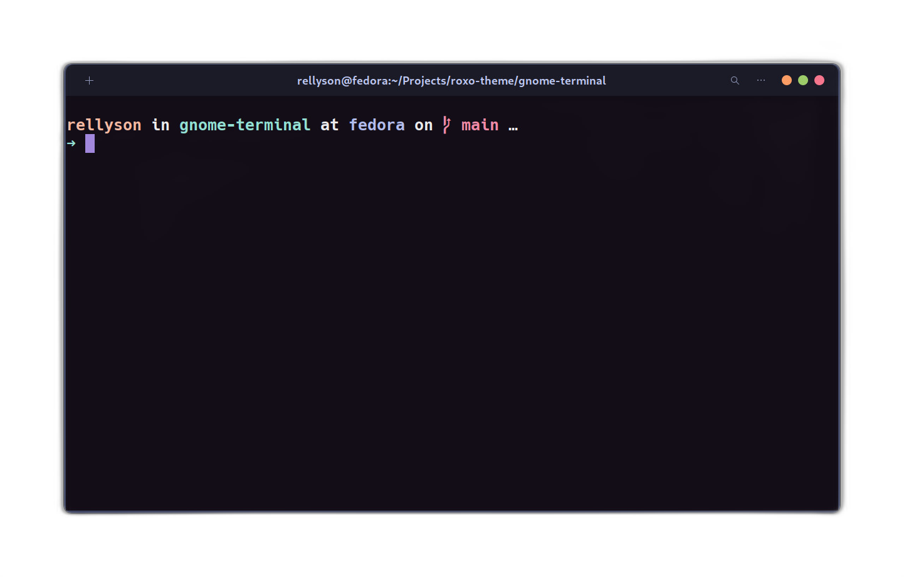

<div align="center">

# Roxo for GNOME terminal


[](https://opensource.org/licenses/MIT)



</div>

## Installation

- Get [roxo-theme.dconf](https://raw.githubusercontent.com/roxo-theme/gnome-terminal/main/roxo-theme.dconf)
  and save it to a directory, e.g. `$HOME/Downloads/roxo-theme.dconf`.
- Open GNOME terminal and execute the command:

  ```sh
  dconf load /org/gnome/terminal/legacy/profiles:/ < $HOME/Downloads/roxo-theme.dconf
  ```

- Open _Preferences_ and select **Roxo Theme** profile.
